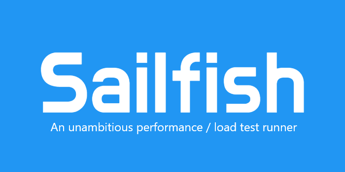

<h3 align="center"><div style="display: flex; justify-content: center"></div></h3>

<h3 align="center">

Available on [Nuget](https://www.nuget.org/packages/Sailfish/)

</h3>

<h3 align="center" style="display: flex; flex-direction: row; justify-content: center;">


[](https://sonarcloud.io/summary/new_code?id=sailfish_library)
[](https://codecov.io/gh/paulegradie/Sailfish)
</h3>

<h1 align="center">

[Documentation](https://paulgradie.com/Sailfish/)

</h1>

## 🚀 **Quick Start**

Sailfish is a .NET performance testing framework that makes it easy to write, run, and analyze performance tests with statistical rigor.

### **Basic Performance Test**

```csharp
[Sailfish]
public class MyPerformanceTest
{
    [SailfishMethod]
    public void TestMethod()
    {
        // Your code to test
        Thread.Sleep(10);
    }
}
```

### **Method Comparisons**

Compare multiple algorithms automatically:

```csharp
[WriteToMarkdown]  // Generate consolidated markdown output
[WriteToCsv]       // Generate consolidated CSV output
[Sailfish(SampleSize = 100)]
public class AlgorithmComparison
{
    [SailfishMethod]
    [SailfishComparison("SortingAlgorithms")]
    public void BubbleSort() { /* implementation */ }

    [SailfishMethod]
    [SailfishComparison("SortingAlgorithms")]
    public void QuickSort() { /* implementation */ }
}
```

**Results include:**
- 📊 **N×N comparison matrices** between all methods in each group
- 📈 **Statistical significance testing** with p-values and confidence intervals
- 📋 **Multiple output formats**: Test output, consolidated markdown, and CSV files
- 🎯 **Performance ratios**: Clear "X times faster/slower" descriptions

## ✨ **Key Features**

- **🔬 Statistical Rigor**: Built-in outlier detection, multiple statistical tests, and significance analysis
- **⚡ Method Comparisons**: Automatically compare multiple algorithms with `[SailfishComparison]`
- **📊 Multiple Output Formats**: Test output, markdown, and CSV with session-based consolidation
- **🎯 Easy Integration**: Works with existing test frameworks and CI/CD pipelines
- **📈 Historical Analysis**: Compare current runs against previous results with SailDiff
- **🔧 Highly Configurable**: Extensive customization options for test execution and analysis

### Used by:


## 📘 Adaptive Sampling

Adaptive sampling lets Sailfish stop collecting samples once results are statistically stable, instead of using a fixed sample size.

- Convergence criteria (defaults):
  - Coefficient of Variation (CV) ≤ 5%
  - Relative Confidence Interval width ≤ 20% at 95% confidence

### Attribute-based (per-class)
```csharp
[Sailfish(UseAdaptiveSampling = true, TargetCoefficientOfVariation = 0.05, MaximumSampleSize = 1000)]
public class StableTiming
{
    [SailfishMethod]
    public async Task Work() => await Task.Delay(10);
}
```

### Global configuration (all tests in a run)
```csharp
var runSettings = RunSettingsBuilder.CreateBuilder()
    .WithGlobalAdaptiveSampling(targetCoefficientOfVariation: 0.05, maximumSampleSize: 500)
    // other options like .WithGlobalSampleSize(...), .DisableOverheadEstimation(), etc.
    .Build();
```

Note: Global settings act as defaults/overrides and can be combined with attribute settings per class.
